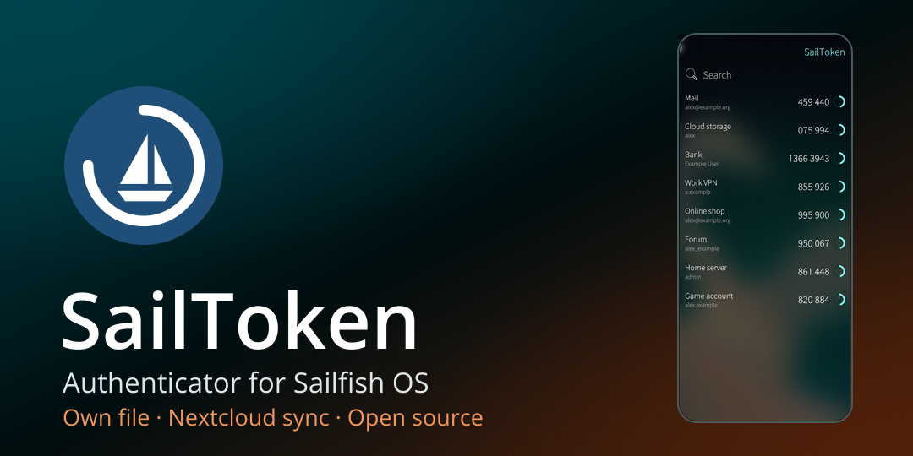
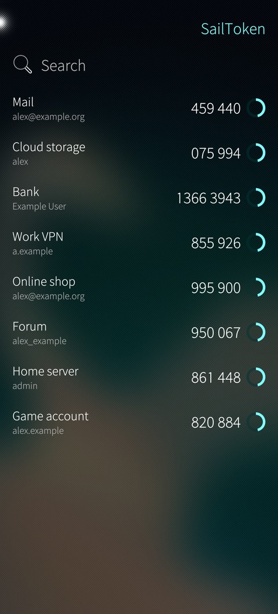
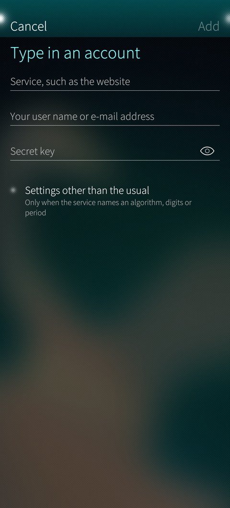
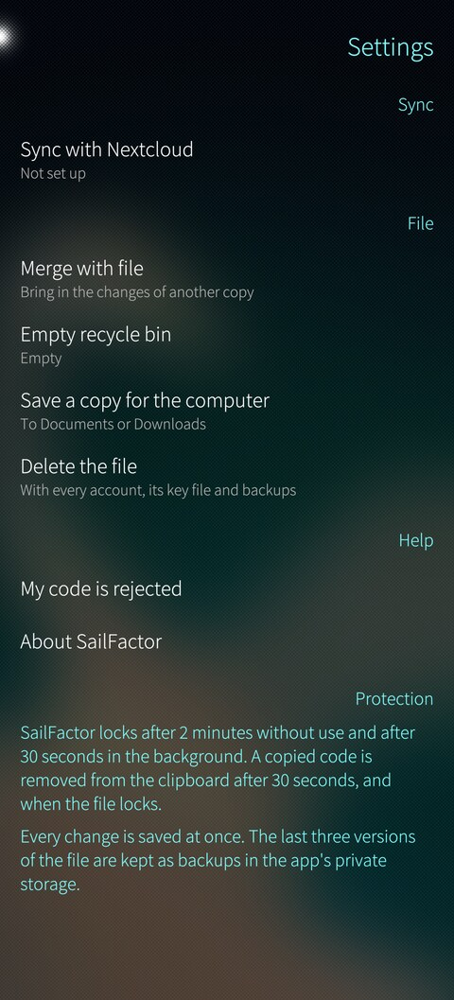

# SailFactor



A TOTP authenticator for Sailfish OS that keeps the second factor apart
from the password manager. The accounts live in an encrypted file of their
own, with its own master password, in the standard KeePass (KDBX 4) format:
KeePassXC on a computer opens the same file and shows the same codes.

What the separation gives: if the password manager's file or its master
password leaks, the second factor is still safe. What it does not give:
protection against a compromised phone, which holds both apps.

**Status:** version 0.4.0, tested on the Jolla Phone with Sailfish OS
5.2. Not in the Jolla Store yet; build the RPM yourself as
described below. The full plan is in [PLAN.md](PLAN.md).

<p align="center">
  
  
  
</p>

The screenshots show a demo file with made-up accounts.

## Features

- Add accounts by scanning the QR code a service shows, or by typing the
  secret; the first code shows before the account is saved
- Codes for SHA-1, SHA-256 and SHA-512, 1 to 10 digits, any period, and
  Steam Guard, the same codes KeePassXC shows for the same file
- Reads every way KeePassXC and KeePass store TOTP settings in an entry
- Copy a code with a tap; the clipboard is cleared after 30 seconds
- Rename, delete and reorder accounts, with a recycle bin and entry
  history as in KeePassXC
- Locks after 2 minutes without use and after 30 seconds in the
  background; every change is saved at once, with three backups
- A file from KeePassXC, with or without a key file, is added from
  Documents or Downloads and kept in the app's private storage; a copy for
  the computer is saved to Documents or Downloads
- Sync with your own Nextcloud while the app runs, merged like KeePassXC
  merges, so changes on the phone and on the computer both survive; or
  merge a copy by hand
 Counter-based codes (HOTP) are not supported. The
[threat model](docs/threat-model.md) describes what the app protects
against and where its limits are.

## Building

You need the [Sailfish SDK](https://docs.sailfishos.org/Tools/Sailfish_SDK/)
(tested with 3.13) and its aarch64 build target. Rust dependencies are
vendored in `core/vendor`, so the build works offline.

```sh
sfdk config --global --push target SailfishOS-5.1.0.11-aarch64
sfdk build
```

The RPM lands in `RPMS/`. To run the Harbour validator on it:

```sh
sfdk -c no-fix-version build
sfdk check RPMS/harbour-sailfactor-*.rpm
```

The core tests run on the host and need Rust 1.75 or newer:

```sh
cargo test --manifest-path core/Cargo.toml
```

## Contributing

Bug reports and ideas are welcome as
[issues](https://github.com/tordenskjoldsw/harbour-sailfactor/issues). If
you plan a pull request, open an issue first so we can agree on the
approach. Never attach a real secret, a real QR code or a real database,
not even an encrypted one.

## License

[MIT](LICENSE). The licenses of the bundled Rust crates are listed on the
About page in the app.

SailFactor is an independent project and not affiliated with KeePass,
KeePassXC or Jolla.
